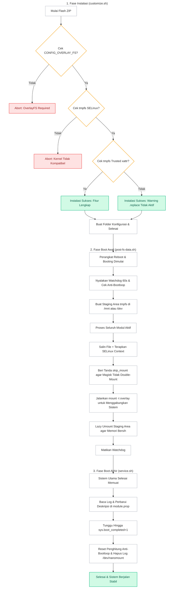

[English](README.md) | [Bahasa Indonesia](README.id.md)

# NanoMount

**Modul OverlayFS profesional yang sangat ringan (ultra-lightweight) untuk menerapkan modifikasi sistem secara global pada perangkat Android modern.**

## Deskripsi Umum

NanoMount adalah modul root berkinerja tinggi yang dirancang untuk menggantikan sistem *bind mount* tradisional dengan sistem OverlayFS yang terpadu dan ringan. Modul ini menyatukan semua file modifikasi sistem ke dalam ruang memori sementara (`tmpfs`) dan menerapkannya secara bersih ke `/system`, `/vendor`, `/product`, serta partisi dinamis lainnya dalam satu langkah terpadu.

---

## Mengapa Memilih NanoMount?

- **Penyamaran & Bypass**: Menaruh file modifikasi di bawah folder staging mirip partisi bawaan pabrik (seperti `/mnt/my_preload` atau `/dev/my_preload`) untuk menyembunyikan mount aktif, sehingga sangat efektif **untuk membuka aplikasi mbanking dan deteksi root lainnya**.
- **Tanpa Beban Penyimpanan**: Berjalan murni di dalam memori (`tmpfs`), menghindari penggunaan berkas citra disk ext4 sparse yang berat dan rawan kerusakan berkas sistem.
- **Booting Sangat Cepat**: Menghindari proses pemindaian `chcon` file-per-file yang lambat saat booting menggunakan metode pengetesan preservasi SELinux satu file secara cerdas.
- **Kompatibilitas Universal**: Bekerja sempurna pada Magisk, Magisk Alpha, KernelSU, dan APatch di perangkat Android 10+.

---

## Persyaratan Sistem

| Persyaratan | Detail |
|-------------|--------|
| Android | 10.0+ (API 29+) |
| Kernel | `CONFIG_OVERLAY_FS=y` & dukungan xattr `security.selinux` pada `tmpfs` |
| Root | Magisk, Magisk Alpha, KernelSU, atau APatch |

---

## Instalasi & Konfigurasi

1. Pasang berkas ZIP melalui tab **Modules** di manager root Anda.
2. **Reboot** (Mulai ulang) perangkat Anda untuk mengaktifkan.
3. Atur konfigurasi pada: `/data/adb/nanomount/config.sh`

---

## Cara Kerja

---

## Pengembang & Lisensi

- **Pengembang**: [dyokism](https://github.com/dyokism)
- **Lisensi**: MIT

