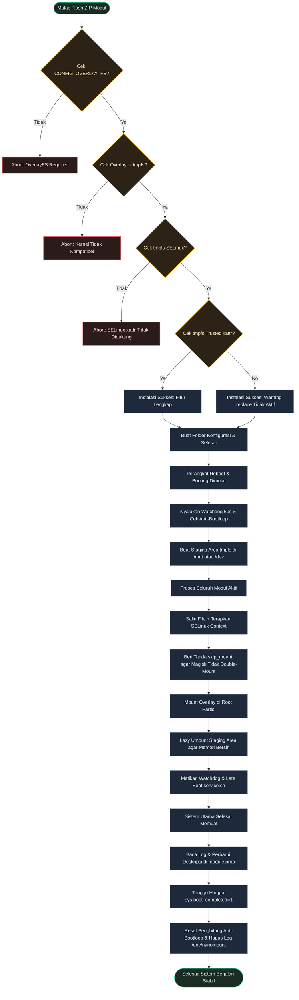

[English](README.md) | [Bahasa Indonesia](README.id.md)

# NanoMount

**Modul OverlayFS berkinerja tinggi dan sangat ringan (ultra-lightweight) untuk menerapkan modifikasi sistem secara global pada perangkat Android modern.**

## Deskripsi Umum

NanoMount adalah modul root yang sangat ringan (*ultra-lightweight*), menggantikan sistem *bind mount* tradisional yang lambat dengan OverlayFS yang ringkas dan cepat. Modul ini memuat seluruh file modifikasi ke dalam ruang penyimpanan sementara di RAM (`tmpfs`), lalu menumpuknya (overlay) secara bersih ke `/system`, `/vendor`, dan `/product` dalam satu langkah terpadu.

---

## Mengapa Memilih NanoMount?

- **Anti Deteksi**: Memasang file di folder tersembunyi (seperti `/dev/my_preload`), sukses melewati verifikasi m-banking dan deteksi root.
- **Murni di RAM**: Berjalan sepenuhnya di memori (`tmpfs`). Tanpa berkas citra ext4 loop, nol pemakaian memori internal, dan bebas korupsi data.
- **Booting Lebih Cepat**: Menghindari perulangan `chcon` file-per-file yang lambat saat booting dengan memverifikasi SELinux di awal.
- **Proteksi Instalasi**: Mendeteksi ketidakcocokan kernel dan SELinux saat instalasi, mencegah bootloop dengan membatalkan pemasangan secara aman.
- **Dukungan Universal**: Bekerja langsung dengan Magisk, KernelSU, dan APatch pada Android 10 ke atas.

---

## Persyaratan Sistem

| Persyaratan | Detail |
|-------------|--------|
| Android | 10.0+ (API 29+) |
| Kernel | `CONFIG_OVERLAY_FS=y`, `tmpfs` sebagai filesystem lower OverlayFS yang valid, & dukungan xattr `security.selinux` pada `tmpfs` |
| Root | Magisk, Magisk Alpha, KernelSU, atau APatch |

*(Catatan: Kompatibilitas KSU + susfs dengan MDM ketat (misal. Intune) belum diverifikasi).*

---

## Instalasi & Konfigurasi

1. Pasang berkas ZIP melalui tab **Modules** di manager root Anda.
2. **Reboot** (Mulai ulang) perangkat Anda untuk mengaktifkan.
3. Atur konfigurasi pada: `/data/adb/nanomount/config.sh`

---

## Resolusi Konflik

Jika beberapa modul memodifikasi file yang sama (misal `/system/etc/hosts`), file yang diproses terakhir akan menang di staging area `tmpfs`:
*   **Mode Otomatis**: Diproses secara **alfabetis** berdasarkan nama folder modul. Folder dengan alfabet terakhir yang menang.
*   **Mode Manual**: Diproses dari **atas ke bawah** sesuai daftar di `/data/adb/nanomount/modules.txt`. Baris paling bawah yang menang.

---

## Mengecualikan Modul

Untuk mencegah NanoMount memproses modul tertentu (misalnya jika tidak kompatibel atau memiliki sistem *mount* mandiri):
*   Buat file kosong bernama `skip_nanomount` di dalam folder modul tersebut:
    `/data/adb/modules/<module-id>/skip_nanomount`
*   NanoMount akan mengabaikan modul tersebut dan menyerahkan pemrosesan sepenuhnya ke manajer root Anda.

---

## Cara Kerja

---

## Pengembang, Kontributor & Lisensi

- **Pengembang**: [dyokism](https://github.com/dyokism)
- **Terima Kasih Khusus**: [bnsmb](https://github.com/bnsmb) karena telah membantu menemukan celah ketidakcocokan kernel.
- **Lisensi**: MIT

