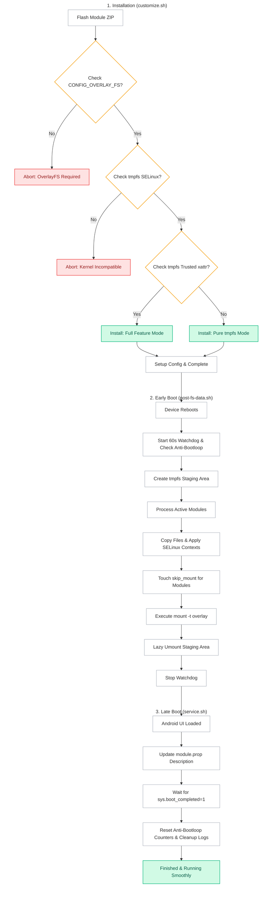

[English](README.md) | [Bahasa Indonesia](README.id.md)

# NanoMount

**A professional, ultra-lightweight OverlayFS module to globally mount system modifications on modern Android devices.**

## Overview

NanoMount is a high-performance root module designed to replace traditional bind mounts with a unified, lightweight OverlayFS system. It aggregates all active module modifications into a memory-backed staging area (`tmpfs`) and overlays them cleanly onto `/system`, `/vendor`, `/product`, and other dynamic partitions in a single unified step.

---

## Why Use NanoMount?

- **Stealth & Bypass**: Stages modifications under stock OEM-like paths (e.g., `/mnt/my_preload` or `/dev/my_preload`) to hide active mounts, making it highly effective **to open mobile banking apps and bypass other root detection mechanisms**.
- **Zero Disk Overhead**: Operates purely in-memory (`tmpfs`), eliminating heavy ext4 loop-mount images and potential filesystem corruption.
- **Instant Boot Times**: Avoids slow, file-by-file `chcon` loops during boot using smart, single-file SELinux context preservation sampling.
- **Universal Compatibility**: Works seamlessly across Magisk, KernelSU, and APatch on modern Android 10+ devices.

---

## Requirements

| Requirement | Details |
|-------------|---------|
| Android | 10.0+ (API 29+) |
| Kernel | `CONFIG_OVERLAY_FS=y` & `tmpfs` `security.selinux` xattr support |
| Root | Magisk, Magisk Alpha, KernelSU, or APatch |

---

## Installation & Configuration

1. Install the ZIP file via your root manager's **Modules** tab.
2. **Reboot** your device to activate.
3. Configure settings at: `/data/adb/nanomount/config.sh`

---

## How It Works

---

## Developer & License

- **Developer**: [dyokism](https://github.com/dyokism)
- **License**: MIT

