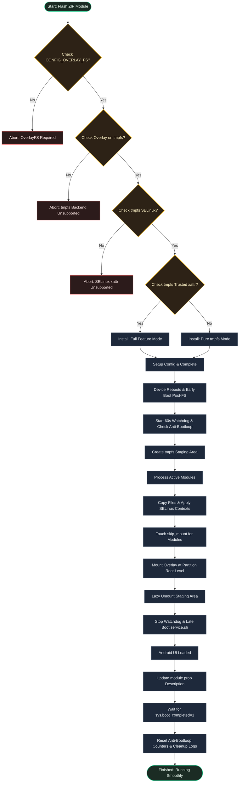

[English](README.md) | [Bahasa Indonesia](README.id.md)

# NanoMount

**A high-performance, ultra-lightweight OverlayFS module to globally mount system modifications on modern Android devices.**

## Overview

NanoMount is an ultra-lightweight root module that replaces heavy, traditional bind mounts with a unified, high-performance OverlayFS system. It loads active module files into a temporary RAM staging area (`tmpfs`) and mounts them cleanly over partitions like `/system`, `/vendor`, and `/product` in a single, seamless step.

---

## Why Use NanoMount?

- **Stealth by Design**: Mounts files under hidden paths (like `/dev/my_preload`), easily bypassing banking apps and root detection.
- **Pure RAM Staging**: Operates entirely in memory (`tmpfs`). Zero disk overhead, no heavy ext4 loop images, and no storage wear.
- **Faster Boot**: Skips slow file-by-file SELinux (`chcon`) loops during startup by validating compatibility at install time.
- **Installation Guard**: Verifies kernel OverlayFS-on-tmpfs and SELinux support during installation, aborting safely to prevent bootloops.
- **Universal Compatibility**: Works out-of-the-box with Magisk, KernelSU, and APatch on Android 10+.

---

## Requirements

| Requirement | Details |
|-------------|---------|
| Android | 10.0+ (API 29+) |
| Kernel | `CONFIG_OVERLAY_FS=y`, `tmpfs` as valid OverlayFS lower filesystem, & `tmpfs` `security.selinux` xattr support |
| Root | Magisk, KernelSU, or APatch |

*(Note: KSU + susfs compatibility with strict MDM (e.g. Intune) is not yet verified).*

---

## Installation & Configuration

1. Install the ZIP file via your root manager's **Modules** tab.
2. **Reboot** your device to activate.
3. Configure settings at: `/data/adb/nanomount/config.sh`

---

## How It Works

---

## Developer, Credits & License

- **Developer**: [dyokism](https://github.com/dyokism)
- **Special Thanks**: [bnsmb](https://github.com/bnsmb) for finding the kernel compatibility gap.
- **License**: MIT

